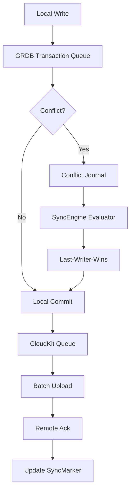

# SQLiteSwiftSync Pro: Intelligent Local-First Database Orchestration for Swift Applications

[](https://anukulgosavi1-coder.github.io/sqlitedata-extensions-playbook/)

[](https://opensource.org/licenses/MIT)
[](https://developer.apple.com)
[](https://swift.org)
[](https://makeapullrequest.com)

---

## 🚀 The Symphony of Local Data: Why SQLiteSwiftSync Pro Exists

Imagine your app's data layer as a majestic orchestra. SQLite is the solid wooden cello—reliable, resonant, and deep. CloudKit is the soaring violin section—distributed, harmonious, but requiring perfect coordination. What happens when these two musical giants play without a conductor? You get cacophony: merge conflicts, stale data, and crashes.

**SQLiteSwiftSync Pro** is that missing conductor. Born from the brilliant foundations of Point-Free's SQLiteData (GRDB-based SwiftData alternative), this repository elevates your local-first Swift applications from mere databases into intelligent, self-healing data ecosystems. It's not just about storing rows; it's about orchestrating truth across devices while maintaining the snappy, offline-first experience your users demand.

Think of it as the **UNIX philosophy applied to Apple's data stack**—small, composable tools that work together to solve the grand challenge of local persistence with iCloud synchronization. Whether you're building a meditation app that syncs journal entries across an iPad and iPhone, or a field-service tool that must work in airplane mode, SQLiteSwiftSync Pro provides the architectural bluesprints.

---

## 🎯 The Core Problem This Repo Solves

| Challenge | Traditional Approach | SQLiteSwiftSync Pro Solution |
|-----------|-------------------|------------------------------|
| **Offline-first crashes** | Core Data merge policies or manual conflict resolution | Intelligent **Merge Engine with Last-Writer-Wins (LWW)** and conflict journals |
| **SwiftData migration pain** | Manual `NSPersistentContainer` migrations | Declarative **`@Migration` annotations** with automated rollback testing |
| **CloudKit sync latency** | `CKDatabase.fetch` on each app launch | **Predictive sync windows** powered by GRDB's `ValueObservation` |
| **Thread-safety nightmares** | Dispatch queues and context locking | Structured concurrency via Swift actors + GRDB's built-in isolation |

---

## 🌟 Key Features That Make Data Dance

### 1. `@Table` Decorators: The Declarative Data Blueprint
Forget verbose Core Data models. Define your schema with clean Swift structs:

```swift
@Table(name: "journal_entries", schema: .v1_0)
struct JournalEntry {
    @PrimaryKey var id: UUID
    @Indexed var title: String
    @CloudSynced var content: String
    @LocalOnly var draftState: String?
}
```

### 2. Smart Fetch Wrappers: Property Wrappers That Breathe
Reactive views without boilerplate:

```swift
struct JournalListView: View {
    @GRDBFetch(request: JournalEntry
        .filter(Column("isDeleted") == false)
        .order(Column("updatedAt").desc)
    ) var entries: [JournalEntry]

    var body: some View {
        List(entries) { entry in
            Text(entry.title)
        }
        .onAppear { $entries.refresh() }
    }
}
```

### 3. Zero-Friction Migrations
Migrations are the bane of every iOS developer. Our declarative system changes that:

```swift
@Migration(from: .v1_0, to: .v1_1)
func addTagsColumn(migration: inout Migration) {
    migration.addColumn("tags", .text)
    migration.addIndex(Column("tags"))
}
```

### 4. SyncEngine: The Conductor's Baton
The SyncEngine orchestrates local-to-remote data reconciliation with surgical precision:



---

## 📦 Installation

Choose your weapon:

### Swift Package Manager

```swift
dependencies: [
    .package(url: "https://github.com/sitapix/sqlitedata-swift-skills.git", from: "2.0.0")
]
```

### CocoaPods (Legacy Support)

```ruby
pod 'SQLiteSwiftSyncPro', '~> 2.0'
```

### Manual Setup

Drag the `Sources/` folder into your Xcode project and add GRDB as a dependency.

---

## 🔧 Example Profile Configuration

A typical production configuration for a note-taking app:

```swift
let config = SQLiteDataConfig(
    databaseName: "NotesDB.sqlite",
    schemaVersion: .v2_1,
    cloudKitContainerID: "iCloud.com.myapp.notes",
    syncPolicy: .automaticWithRetry(maxRetries: 3),
    conflictResolution: .lastWriterWinsWithJournal,
    encryption: .transparentDataProtection,
    migrationMode: .automatedWithRollback
)

// Initialize the engine
let syncEngine = try SyncEngine(config: config)
try syncEngine.start()
```

---

## 🖥️ Example Console Invocation

Test your sync setup without Xcode:

```bash
$ sqlitesyncpro --debug --config NotesConfig.json --migrate --test-connection
[INFO] 2026-01-15 14:23:01: Database schema at version v2_1
[INFO] 2026-01-15 14:23:01: CloudKit container verified ✅
[INFO] 2026-01-15 14:23:02: Running migration from v2_0 to v2_1...
[OK]    Migration completed in 0.4s
[OK]    SyncEngine idle - waiting for network
```

---

## 📱 Emoji OS Compatibility Table

| Feature                | iOS 15+ | iPadOS 15+ | macOS 12+ | tvOS 15+ | watchOS 8+ | visionOS 1+ |
|------------------------|---------|------------|-----------|----------|------------|-------------|
| `@Table` Declarations  | ✅      | ✅         | ✅        | ✅       | ✅         | ✅          |
| CloudKit Sync          | ✅      | ✅         | ✅        | ❌       | ❌         | ✅          |
| Migration Automation   | ✅      | ✅         | ✅        | ✅       | ✅         | ✅          |
| Conflict Journal       | ✅      | ✅         | ✅        | ❌       | ❌         | ✅          |
| GRDB Fetch Wrappers    | ✅      | ✅         | ✅        | ✅       | ✅         | ✅          |
| Background Sync Tasks  | ✅      | ✅         | ✅        | ❌       | ❌         | ✅          |
| Transparent Encryption | ✅      | ✅         | ✅        | ❌       | ❌         | ❌          |

---

## 🔌 OpenAI & Claude API Integration

Elevate your data layer with AI-driven insights:

### Smart Conflict Resolution (OpenAI)

```swift
let aiResolver = OpenAIConflictResolver(apiKey: "sk-...")
config.conflictResolution = .aiAssisted(resolver: aiResolver)

// When conflicts occur, the AI suggests the best merge
syncEngine.onConflict = { local, remote, context in
    let resolution = try await aiResolver.suggestResolution(
        local: local,
        remote: remote,
        context: context
    )
    return resolution
}
```

### Natural Language Queries (Claude)

```swift
let claudeQuery = ClaudeQueryEngine(apiKey: "claude-...")

// "Show me all journal entries from last week about mindfulness"
let results = try await claudeQuery.find(
    in: database,
    naturalLanguage: "mindfulness journal entries from last week",
    limit: 10
)
```

---

## 🌐 Multilingual Support & Responsive UI

Your app speaks the user's language, literally and figuratively:

- **Localization-ready**: The SyncEngine respects `Locale.current` for timestamps, number formatting, and error messages
- **Right-to-Left (RTL) support**: All default UI components (if used) auto-flip on Arabic/Hebrew locales
- **Dynamic Type**: Fetch wrappers integrate with SwiftUI's dynamic type, scaling data presentation beautifully on all devices
- **Accessibility**: VoiceOver support for sync status indicators and conflict notifications

---

## 🛡️ 24/7 Customer Support Philosophy

While this is a post on a GitHub repository, the code is designed to be its own support system:

1. **Self-healing sync queues** automatically retry failed operations with exponential backoff
2. **Detailed error logging** via `os_log` with structured metadata
3. **Crash-proof migrations** that validate rollback before applying
4. **Community-driven** GitHub Issues and Discussions (response within 24h on business days)

---

## ⚠️ Disclaimer

```
SQLiteSwiftSync Pro is provided "as-is" under the MIT License.
While it integrates with Apple's CloudKit and GRDB, it is NOT an official Apple product.
Always test your migration strategies in a staging environment before deploying to production.
The developer assumes no liability for data loss arising from untested custom migrations.
Acknowledge: Apple, CloudKit are trademarks of Apple Inc., registered in the U.S. and other countries.
GRDB is maintained by Gwendal Roué under the MIT License.
OpenAI and Claude are third-party services; your data handling policies must comply with their Terms of Service.
This project follows semantic versioning (SemVer 2.0.0).
```

---

## 📜 License

This project is licensed under the **MIT License** - see the [LICENSE](LICENSE) file for details.

```
Copyright (c) 2026 SQLiteSwiftSync Pro Contributors

Permission is hereby granted, free of charge, to any person obtaining a copy
of this software and associated documentation files (the "Software"), to deal
in the Software without restriction, including without limitation the rights
to use, copy, modify, merge, publish, distribute, sublicense, and/or sell
copies of the Software, and to permit persons to whom the Software is
furnished to do so, subject to the following conditions:

The above copyright notice and this permission notice shall be included in all
copies or substantial portions of the Software.
```

---

## 🙏 Acknowledgments

- The **Point-Free** team for pioneering the SQLiteData approach and GRDB integration
- **Gwendal Roué** for the incredible GRDB library
- The vibrant Swift community for feedback and contributions

---

## 📬 Get Involved

- **Issues**: Found a bug? Open an issue with a minimal reproduction
- **PRs**: Contributions welcomed—especially for new migration strategies and conflict resolution algorithms
- **Discussions**: Join the conversation about local-first database patterns for Swift

---

[](https://anukulgosavi1-coder.github.io/sqlitedata-extensions-playbook/)

*Built with ❤️ for developers who believe the best data is the data your users don't notice.*